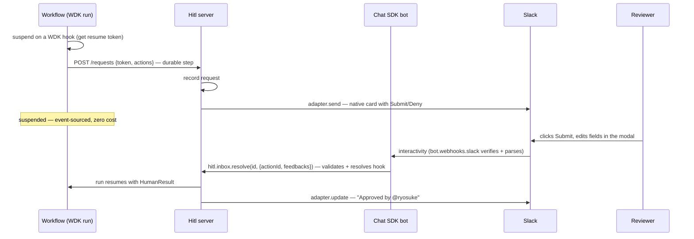

# Architecture

## How it works

The workflow and the server are separate processes (Workflow DevKit runs workflows in their own sandbox). The `.well-known/hitl/v1` API is the only thing between them. The workflow client carries no state backend and no adapters.

## What Hitl SDK owns

| Piece | What it is |
|---|---|
| Server (`Hitl`) | The `.well-known/hitl/v1` internal API: request creation, timeout/remind. Owns the state backend and adapters; inbox via `hitl.inbox` |
| Workflow client (`createHitlClient` / `workflowHitl`) | `waitForHuman` / `notify` — suspends, calls the server, drives the timeout/reminder loop. Reminders support relative delays (`after`), wall-clock times (`at`, `tomorrowAt`), and repeating schedules (`dailyAt`, `weekdaysAt`, `every`) via the `remind` / `escalate` builders |
| Engine bindings | One small package per engine (`@hitl/resolver-workflow-sdk`, …) implementing `WorkflowPrimitives` + `HitlResolver` |
| Channels | `@hitl/adapter-chat-sdk` — one Chat SDK-backed adapter that renders native cards and routes interactivity to `hitl.inbox` across every platform; plus the built-in `inboxChannel` (no-op delivery; resolved via `hitl.inbox`) |
| Approval state | The `State` interface for pending/resolved requests (powers the inbox and audit). In-memory by default; `@hitl/state-pg` and `@hitl/state-sqlite` for persistence |

## What Hitl SDK does not own

- Durable execution, suspension, replay → **the engine** (Workflow DevKit in v0; see [Engine bindings](#engine-bindings))
- Agents, LLM calls, tools → **AI SDK** (or Mastra, or anything else)
- Deployment, secrets, versioning → **your app and your platform**

## Engine bindings

Hitl SDK asks four things of the execution engine, split across the two sides:

1. **Suspend with a token** (workflow side): create a durable wait and obtain an opaque resume token
2. **A durable timer** (workflow side, for `timeout` and `reminders`). The client expands reminder rules into a sorted fire schedule at wait start, then sleeps until each fire or timeout. Wall-clock rules resolve against `process.env.TZ`, the host timezone, or an explicit `tz` option.
3. **A durable request** (workflow side): an HTTP call to the server, memoized across replays
4. **Resolve by token** (server side): resume the wait with a payload when a callback arrives

All state and adapter IO lives on the server, so the workflow side never runs arbitrary effects — it only suspends, sleeps, and makes durable HTTP calls.

| Engine | Suspend | Timer | Request (durable step) | Resolve |
|---|---|---|---|---|
| Workflow DevKit | `createHook()` | `sleep()` | `"use step"` `fetch` | `resumeHook(token, payload)` |
| Temporal | signal + `condition()` | `condition(pred, timeout)` | activity | `handle.signal(workflowId, payload)` |
| Inngest | `step.waitForEvent(...)` | built-in (null → `TIMED_OUT`) | `step.run` `fetch` | `inngest.send(event)` with correlation |
| Restate | `ctx.awakeable()` | `ctx.sleep` | `ctx.run` `fetch` | `resolveAwakeable(id, payload)` |

The architecture is split along that contract:

- **Core (engine-agnostic):** approval state, field builders, `HumanResult` typing and validation, the adapter interface, server services and HTTP layer (`Hitl`), and the workflow-side client (`createHitlClient`). Knows nothing about engines.
- **Binding (per engine, thin):** `WorkflowPrimitives` (`suspend` / `sleep` / `request`) on the workflow side; `HitlResolver` (`resolve`) on the server side. `@hitl/resolver-workflow-sdk` packages this as `workflowHitl()` + `workflowResolver()`.

The resume token is opaque to the core — for Temporal it might encode `{ workflowId, signalId }`, for Inngest a correlation key. The core stores it and hands it back.

Switching engines means switching one import and the `resolver` in `new Hitl()`. Adapters, state, inbox, and workflow helpers stay shared. Today only the Workflow DevKit binding ships (`@hitl/resolver-workflow-sdk`).
