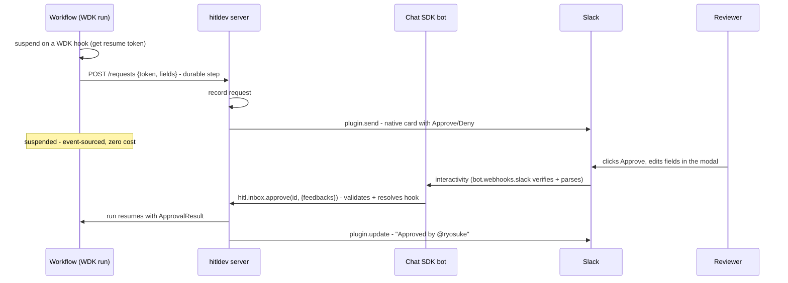

# hitldev

**Human-in-the-loop as a typed, durable primitive for TypeScript workflows.**

```ts
const approval = await waitForApproval({
  message: `Send this reply to ${input.email}?`,
  fields: {
    subject: field.textField({ label: "Subject", default: draft.subject }),
    body: field.textArea({ label: "Body", default: draft.body }),
  },
});
```

One `await`. The workflow suspends — for hours or days, at zero cost, surviving deploys and crashes. A reviewer gets the request in Slack, Teams, or a web inbox, edits the fields, and clicks approve. The workflow resumes with the edited, fully-typed values.

hitldev is **not an agent framework**. Bring your own — the [AI SDK](https://ai-sdk.dev), Mastra, or anything that runs inside a [Workflow DevKit](https://workflow-sdk.dev) workflow. hitldev does one thing: the human part.

> **Status: early.** The core, the Workflow DevKit binding, the Chat SDK channel (Slack / Teams / Discord and more via the Vercel Chat SDK) and the built-in web inbox, and the SQLite / Postgres state backends are implemented and tested; the runnable [`examples/hello-world`](examples/hello-world) exercises the full approve loop. The API below is still pre-1.0 and may change.

## Why

Agents that do real work — sending emails, posting messages, issuing refunds — need a human between the draft and the side effect. Everyone building this hits the same wall:

- **Approval is not a boolean.** Reviewers don't just approve or deny; they fix the subject line and rewrite a paragraph. The result must come back typed.
- **The wait is long.** Hours to days. The workflow must suspend durably — no polling loop, no state machine glued to a queue, no lost runs on redeploy.
- **Reviewers live in Slack and Teams**, not in your admin panel. But your workflow code shouldn't know or care which.
- **Existing options are a SaaS or DIY.** Hosted approval services own your data and your flow; hand-rolled Slack glue (interactivity endpoints, payload parsing, state correlation) is the code everyone writes badly, twice.

hitldev is the missing library: open source, typed end-to-end, native to a durable execution engine.

## Design principles

1. **One primitive, done well.** `waitForApproval` (and its list form, `waitForBatchApprovals`) and `notify`. No agent abstraction, no workflow engine, no triggers, no deploy story. Compose it with what you already use.
2. **Typed feedbacks.** Field builders define what a reviewer can edit; `REVIEWED` results carry the edited values, typed by inference. The reviewer's edit is data, not a comment.
3. **Durable by construction.** Built on the engine's native suspension via a thin binding (Workflow DevKit hooks in v0): suspension is event-sourced, resumption survives restarts and deploys. hitldev adds no runtime of its own.
4. **Channel-agnostic.** Workflow code declares *what* needs review. Plugins — explicit instances with an `id` and their own token — decide *where* it renders and *how* it comes back.
5. **Thin by design.** A library, a few channel plugins, an inbox UI. No platform, no vault, no control plane. Nothing to operate beyond what you already run.

## Quick example

A Workflow DevKit workflow using the plain AI SDK for drafting and hitldev for the human step:

```ts
// workflows/inbound-lead.ts
import { z } from "zod";
import { generateObject } from "ai";
import { field } from "hitl";
import { waitForApproval } from "../lib/hitl-workflow";
import { sendEmail } from "../lib/email";

export async function inboundLead(input: { email: string; message: string }) {
  "use workflow";

  const { object: draft } = await generateObject({
    model: "anthropic/claude-sonnet-4-5",
    schema: z.object({ subject: z.string(), body: z.string() }),
    prompt: `Draft a reply to this inbound lead:\n${input.message}`,
  });

  // Suspends the run until a human responds — days if necessary.
  const approval = await waitForApproval({
    channel: "lead-approvals",            // plugin id; defaults to the first configured plugin
    message: `Inbound lead: ${input.email}`,
    fields: {
      subject: field.textField({ label: "Subject", default: draft.subject }),
      body: field.textArea({ label: "Body", default: draft.body }),
    },
    timeout: "72h",
    reminder: [
      { after: "0s", message: `Original message:\n${input.message}` },
      { after: "24h", message: "Still waiting for review" },
    ],
  });

  if (approval.type === "DENIED" || approval.type === "TIMED_OUT") return;

  const { subject, body } =
    approval.type === "REVIEWED" ? approval.feedbacks : draft;

  await sendEmail({ to: input.email, subject, body });
}
```

hitldev has two sides. The **server** owns the state and the channel plugins and runs at the app edge. The **workflow client** knows neither — it is a thin HTTP client that reaches the server over a stable, secret-authenticated API.

Wire the server once:

```ts
// lib/hitl.ts — the server: state + channel plugin, mounted as route handlers.
import { Hitl } from "hitl";
import { chatHitl } from "@hitl/adapter-chat-sdk";
import { workflowResolver } from "@hitl/resolver-workflow-sdk";
import { Chat } from "chat";
import { createSlackAdapter } from "@chat-adapter/slack";
import { createTeamsAdapter } from "@chat-adapter/teams";

// One Chat SDK instance owns webhook verification, payload parsing, and native
// card rendering (Block Kit, Adaptive Cards, …) for every platform you enable.
const bot = new Chat({
  adapters: { slack: createSlackAdapter(), teams: createTeamsAdapter() },
  state: createRedisState(),            // any Chat SDK state adapter
});

export const hitl = new Hitl({
  resolver: workflowResolver(),         // resumes the suspended workflow when a callback lands
  secret: process.env.HITLDEV_SECRET,   // bearer shared with the workflow client (optional in local dev)
  plugins: [
    // `channel` is a Chat SDK channel ref; `inbox` is lazy because `new Hitl()`
    // needs the plugins before hitl.inbox exists.
    chatHitl({ id: "lead-approvals", bot, channel: "slack:C123", inbox: () => hitl.inbox }),
    chatHitl({ id: "teams-approvals", bot, channel: "teams:19:...", inbox: () => hitl.inbox }),
  ],
});

// Mount hitldev under /.well-known/hitldev/v1 — it serves the internal
// workflow→server API. Channel interactivity and inbox UI are your own
// handlers on top of hitl.inbox, not hitldev HTTP routes:
//   export const POST = bot.webhooks.slack    // app/api/webhooks/slack/route.ts
// Next.js:  export const { POST } = hitl.routeHandlers   // app/.well-known/hitldev/v1/[[...path]]/route.ts
// Express:  app.use("/.well-known/hitldev/v1", hitl.handler)
```

Build the workflow client once too. It needs one durable step — a plain `"use step"` `fetch` to the server, defined in your app so the Workflow DevKit compiler picks up the directive:

```ts
// lib/hitl-workflow.ts — the workflow side: a thin HTTP client. No state, no plugins.
import type { HitlRequest } from "hitl";
import { workflowHitl } from "@hitl/resolver-workflow-sdk";

async function hitlRequest(req: HitlRequest) {
  "use step";
  const res = await fetch(req.url, { method: req.method, headers: req.headers, body: req.body });
  return { status: res.status, ok: res.ok, body: await res.text() };
}

export const { waitForApproval, waitForBatchApprovals, notify } = workflowHitl({ request: hitlRequest });
```

Workflow code imports from there:

```ts
import { waitForApproval } from "../lib/hitl-workflow";

const approval = await waitForApproval({ message: "..." });
```

The workflow suspends on an engine hook, POSTs the request to the server, and the server delivers it to the channel. When the reviewer responds, the Chat SDK bot receives the interactivity (it owns webhook verification and payload parsing for every platform) and resolves via `hitl.inbox` — which resumes the suspended run. The base URL defaults to the deployment's own URL (set `HITLDEV_URL` to override); the two sides share `HITLDEV_SECRET` to authenticate the internal API. The server's state can stay the default in-memory one for a single process, or be a shared `@hitl/state-sqlite` / `@hitl/state-pg` for production.

## API

### `waitForApproval`

```ts
const approval = await waitForApproval({
  message: string,
  fields?: Record<string, HitlField>,  // fields the reviewer can edit
  channel?: string,                       // plugin id; defaults to the first configured plugin
  timeout?: Duration,                     // e.g. "72h"; resolves as { type: "TIMED_OUT" }
  reminder?: ReminderEntry[],            // remind / escalate while pending (see below)
});
```

While pending, `reminder` entries fire on a durable timer:

```ts
reminder: [
  { after: "24h", message: "Still waiting for review" },           // same-channel thread remind
  { after: "48h", channel: "oncall", message: "Unanswered" },      // escalate (notify fallback channel)
  { after: "48h", channel: "oncall", mode: "redeliver" },          // escalate (re-send approval UI)
]
```

- `{ after, message? }` — threaded remind on the approval channel (`message` defaults to `"Reminder: approval still pending"`)
- `{ after, channel, message?, mode? }` — escalate to another plugin id (`mode` defaults to `"notify"`)

The result is a discriminated union, with `feedbacks` typed by the field definitions:

```ts
type ApprovalResult<F> =
  | { type: "APPROVED"; id: string; by?: Reviewer }
  | { type: "DENIED"; id: string; by?: Reviewer; reason?: string }
  | { type: "REVIEWED"; id: string; by?: Reviewer; feedbacks: F }  // approved with edits
  | { type: "TIMED_OUT"; id: string };
```

Under the hood, `waitForApproval` suspends on a Workflow DevKit hook and POSTs the request to the server over a durable step; the server records it and delivers it via the plugin. The human's response resolves the hook and resumes the run — across restarts and deploys. `timeout` and `reminder` run on the workflow's durable timer, calling the server's API when they fire.

### `waitForBatchApprovals`

The list form of `waitForApproval`: deliver many approvals as **one message**, reviewed and submitted together.

```ts
const results = await waitForBatchApprovals({
  title: "Outbound emails",
  fields: {
    subject: field.textField({ label: "Subject", default: "Hi" }),
  },
  items: [
    { message: "Email to ACME", defaults: { subject: "Hello ACME" } },
    { message: "Email to Globex" },   // uses the shared field defaults
  ],
  channel: "lead-approvals",
  timeout: "72h",                      // one timeout for the whole batch
  reminder: [{ after: "24h" }],        // reminders/escalation are batch-level too
});
// results: ApprovalResult<{ subject: string }>[], in item order
```

- **Shared field schema.** `fields` is defined once for the whole batch; each item overrides initial values via `defaults`. Every result's `feedbacks` is typed by the same schema.
- **One submit.** The reviewer picks approve/deny per item (and edits fields where the channel supports it), then submits once — one callback resolves the whole batch. Items resolve independently: the same submit can produce `APPROVED`, `DENIED`, and `REVIEWED` results side by side.
- **All-items completion.** The workflow suspends until every item is resolved and returns results in input order. On `timeout`, items already resolved keep their result; the rest become `TIMED_OUT`.
- **Fallback delivery.** Channels that can't render the batch as one message (no `sendBatch`, or `canSendBatch` returns `false` — e.g. over the channel's size limits) receive one regular approval message per item; the batch still waits for all of them.

With the `@hitl/adapter-chat-sdk` plugin, batches are always delivered per item — each item is its own approval card, reviewed and resolved independently (the batch still waits for all of them). A single-message batch UI isn't used because Chat SDK cards can't read multi-select state on submit.

### Field builders

```ts
field.textField({ label, default? })
field.textArea({ label, default? })
field.select({ label, options, default? })
field.confirm({ label, default? })
```

Each field renders natively per platform via the Chat SDK — text inputs in a modal, selects and confirms as native controls — and contributes its type to `feedbacks`.

### `notify`

Fire-and-forget progress updates and threaded context:

```ts
await notify({ message: string, parent?: string, channel?: string });
```

### Plugin interface

Workflow code declares intent; a plugin — instantiated in `new Hitl()`, never imported by workflow code — owns rendering and delivery. With the Chat SDK plugin, receiving interactivity is owned by the Chat SDK bot, which resolves via `hitl.inbox` (see [Receiving interactivity](#receiving-interactivity-existing-bots) below).

```ts
interface HitlPlugin {
  id: string;   // routing key used by waitForApproval({ channel }) / notify({ channel })
  // Render and deliver an approval request (Slack Block Kit message,
  // Teams Adaptive Card, email with a link to the web inbox, ...)
  send(request: ApprovalRequest): Promise<{ externalId: string }>;
  // Reflect resolution back into the channel (e.g. replace buttons with "Approved by @ryosuke")
  update?(externalId: string, result: ApprovalResult): Promise<void>;
  notify(notification: Notification): Promise<void>;
  // Batch capability (optional): render a whole batch as a single message.
  // Absent sendBatch — or canSendBatch returning false — makes the core
  // fall back to one send() per item.
  sendBatch?(request: BatchApprovalRequest): Promise<{ externalId: string }>;
  canSendBatch?(request: BatchApprovalRequest): boolean;
  updateBatch?(externalId: string, results: ApprovalResult[]): Promise<void>;
}
```

Official plugin:

| Plugin | Package | Renders as |
|---|---|---|
| `chatHitl()` | `@hitl/adapter-chat-sdk` | Native cards on every [Chat SDK](https://chat-sdk.dev) platform — Block Kit (Slack), Adaptive Cards (Teams), embeds + modal (Discord), and more. Approve/Deny buttons; feedback fields open in a modal |
| Web inbox | built into `hitldev` (always on) | No external service; read and resolve via `hitl.inbox` (React components from `@hitldev/ui`) |

`@hitl/adapter-chat-sdk` wraps the Vercel Chat SDK, so one plugin covers every platform its adapters support — you enable platforms by registering their adapters on the `Chat` instance, not by installing more hitldev packages. The web inbox is always present. Writing your own plugin is implementing the interface above.

<a id="receiving-interactivity-existing-bots"></a>
**Receiving interactivity (the Chat SDK bot).** Each platform exposes a single interactivity endpoint; the Chat SDK `bot` owns it through `bot.webhooks.<adapter>`, handling signature verification (Slack HMAC, Teams JWT, Discord Ed25519) and payload parsing for every platform. `chatHitl` registers approve/deny and modal handlers on that bot which resolve through the framework-agnostic `hitl.inbox` (`approve` / `deny` / `submitBatch`). hitldev's own handler is just the internal workflow API, so it co-hosts inside your existing server alongside your inbox and webhook routes — one process, one port.

### `Hitl` (server side)

The server. Takes plugins, a state backend, and a resolver; returns mountable handlers:

```ts
const hitl = new Hitl({ resolver, state, plugins: [...], secret });

hitl.fetch             // fetch-style handler — mount under any base path
hitl.handler           // Node/Express-style handler
hitl.routeHandlers     // Next.js route handlers
hitl.inbox             // programmatic inbox: list / get / approve / deny / submitBatch
hitl.runtime / hitl.state / hitl.plugins   // explicit access (advanced)
```

`plugins` is optional — the web inbox channel is always included, so it adds Slack/Teams/Discord on top (the first entry is the default delivery channel). `state` defaults to one in-memory state per process; `secret` defaults to `process.env.HITLDEV_SECRET`.

`hitl.inbox` is how you drive an approval UI from your own handlers — `await hitl.inbox.list({ status: "pending" })`, `await hitl.inbox.approve(id, { by })`, `.deny(id, { reason })`, `.submitBatch(batchId, decisions)`. Build your own HTTP routes (see the hello-world example's `/api/inbox`) or wire the Chat SDK bot; hitldev does not expose inbox read/write over `.well-known`.

The handler serves one thing under its mount path (channel interactivity is **not** one of them — the Chat SDK bot receives that and calls `hitl.inbox`):

- **The internal workflow API** (`POST /requests`, `/batches`, `/requests/:id/timeout`, `/requests/:id/remind`, `/notifications`, …) — what the workflow client calls. Authenticated with the bearer `secret`; when no secret is set it is open and logs a warning (local dev only).

### `workflowHitl` (workflow side)

The workflow client, built on the engine's primitives. Returns the workflow helpers:

```ts
const { waitForApproval, waitForBatchApprovals, notify } = workflowHitl({
  request,             // your "use step" function that fetches the server (required)
  url?,                // server base URL; defaults to HITLDEV_URL, then the deployment URL
  basePath?,           // defaults to "/.well-known/hitldev/v1"
  secret?,             // bearer for the internal API; defaults to HITLDEV_SECRET
});
```

`request` is the one piece you write yourself: a `"use step"` function returning the response as plain `{ status, ok, body }` (a `Response` can't cross a step boundary). Defining it in your app — rather than importing a magic durable `fetch` — keeps it an ordinary step the Workflow DevKit compiler can see.

For engines other than Workflow DevKit, drop down to `createHitlClient` from `hitl` and inject the engine's primitives directly (see [Engine bindings](#engine-bindings)).

## How it works



The workflow and the server are separate processes (Workflow DevKit runs workflows in their own sandbox); the `.well-known/hitldev/v1` API is the only thing between them. The workflow client carries no state backend and no plugins.

What hitldev **owns** (all thin, bounded pieces):

| Piece | What it is |
|---|---|
| Server (`Hitl`) | The `.well-known/hitldev/v1` internal API: request creation, timeout/remind. Owns the state backend and plugins; inbox via `hitl.inbox` |
| Workflow client (`createHitlClient` / `workflowHitl`) | `waitForApproval` / `waitForBatchApprovals` / `notify` — suspends, calls the server, drives the timeout/reminder loop |
| Engine bindings | One small package per engine (`@hitl/resolver-workflow-sdk`, ...) implementing `WorkflowPrimitives` + `HitlResolver` |
| Channels | `@hitl/adapter-chat-sdk` — one Chat SDK-backed plugin that renders native cards and routes interactivity to `hitl.inbox` across every platform; plus the built-in `inboxChannel` (no-op delivery; resolved via `hitl.inbox`) |
| Inbox UI | React components: pending approvals, request detail, audit trail |
| Approval state | The `State` interface for pending/resolved requests (powers the inbox and audit). In-memory by default; `@hitl/state-pg` and `@hitl/state-sqlite` for persistence |

What it **deliberately does not own**:

- Durable execution, suspension, replay → **the engine** (Workflow DevKit in v0; see [Engine bindings](#engine-bindings))
- Agents, LLM calls, tools → **AI SDK** (or Mastra, or anything else)
- Deployment, secrets, versioning → **your app and your platform**

## Engine bindings

hitldev asks very little of the execution engine — exactly four things, split across the two sides:

1. **Suspend with a token** (workflow side): create a durable wait and obtain an opaque resume token
2. **A durable timer** (workflow side, for `timeout` and `reminder`)
3. **A durable request** (workflow side): an HTTP call to the server, memoized across replays
4. **Resolve by token** (server side): resume the wait with a payload when a callback arrives

All state and plugin IO lives on the server, so the workflow side never runs arbitrary effects — it only suspends, sleeps, and makes durable HTTP calls. Every major durable execution engine has native primitives for all four:

| Engine | Suspend | Timer | Request (durable step) | Resolve |
|---|---|---|---|---|
| Workflow DevKit | `createHook()` | `sleep()` | `"use step"` `fetch` | `resumeHook(token, payload)` |
| Temporal | signal + `condition()` | `condition(pred, timeout)` | activity | `handle.signal(workflowId, payload)` |
| Inngest | `step.waitForEvent(...)` | built-in (null → `TIMED_OUT`) | `step.run` `fetch` | `inngest.send(event)` with correlation |
| Restate | `ctx.awakeable()` | `ctx.sleep` | `ctx.run` `fetch` | `resolveAwakeable(id, payload)` |

The architecture is split along that contract:

- **Core (engine-agnostic):** the approval state, field builders, `ApprovalResult` typing and validation, the plugin interface, the server services (`createApprovalRequest`, `resolveApproval`, `timeoutApproval`, …) and HTTP layer (`Hitl`), and the workflow-side client (`createHitlClient`) that drives the reminder/timeout loop and talks to the server. The bulk of the code; knows nothing about engines.
- **Binding (per engine, thin):** two small interfaces. `WorkflowPrimitives` (`suspend` / `sleep` / `request`) is injected into `createHitlClient` on the workflow side; `HitlResolver` (`resolve`) is passed to `new Hitl()` on the server side. For WDK: a hook for `suspend`, `sleep` for the timer, your `"use step"` `fetch` for `request`, and `resumeHook` for `resolve`. `@hitl/resolver-workflow-sdk` packages this as `workflowHitl()` + `workflowResolver()`.

The resume token is **opaque to the core**: for Temporal it encodes `{ workflowId, signalId }`, for Inngest a correlation key. The core just stores it and hands it back.

Switching engines means switching one import (`@hitl/resolver-workflow-sdk` → `@hitl/resolver-temporal-sdk`) and the `resolver` entry in `new Hitl()`. Plugins, the approval state, the inbox, the workflow client — all shared. Today ships the Workflow DevKit binding (`@hitl/resolver-workflow-sdk`) only; the interfaces exist from day one so the others stay an honest estimate of 50–100 lines each.

## Requirements and setup

- Your code runs inside Workflow DevKit workflows — on Vercel (Vercel world, zero config) or self-hosted (`@workflow/world-postgres`).
- **Environment:** set `HITLDEV_SECRET` to the same value for the server and the workflow client — it authenticates the internal `.well-known/hitldev/v1` API. Without it the API is open (and logs a warning), which is fine for local dev. Set `HITLDEV_URL` if the server's base URL isn't the deployment's own URL (`workflowHitl` reads it from the run metadata by default).
- hitldev needs a state backend for approvals, held by the **server** (`new Hitl()`). It defaults to one in-memory state per process; pass a `@hitl/state-pg` or `@hitl/state-sqlite` implementation for persistence and to share state across server instances.
- **Custom `State` implementations:** beyond the single-approval methods, a state backend implements `findByToken` (idempotent request creation keys on the resume token) and the batch methods (`createBatch`, `getBatch`, `setBatchExternalId`, `listByBatch`) — two extra columns plus a companion `<table>_batches` table in the SQL schema, applied automatically by the bundled backends. `describeStateContract` from `hitl/state-contract` covers the expected behavior.
- **SQLite** — schema is created automatically in the constructor; no extra step:

```ts
import { DatabaseSync } from "node:sqlite";
import { SqliteState } from "@hitl/state-sqlite";

const state = new SqliteState(new DatabaseSync("hitldev.db"));
```

- **Postgres** — call `ensureSchema()` once at startup, or apply the exported `schemaSql()` through your own migration tool:

```ts
import pg from "pg";
import { PostgresState } from "@hitl/state-pg";

const pool = new pg.Pool({ connectionString: process.env.DATABASE_URL });
const state = new PostgresState(pool);
await state.ensureSchema();
```

- **Self-hosted Postgres** — one command creates the hitldev approvals table and runs WDK world migrations (when `@workflow/world-postgres` is installed):

```bash
DATABASE_URL=postgres://... npx hitldev setup
```

  Use `npx hitldev schema` to print idempotent DDL for your migration pipeline (`--dialect postgres|sqlite`, `--table hitldev.approvals`).

- Local dev: the always-on web inbox works with zero external services — approve from a local inbox page via `hitl.inbox`, no Slack required.

### Channel setup (Chat SDK)

`@hitl/adapter-chat-sdk` delivers through the [Vercel Chat SDK](https://chat-sdk.dev). Install `chat` and the adapters for the platforms you want (`@chat-adapter/slack`, `@chat-adapter/teams`, `@chat-adapter/discord`, …), create one `Chat` instance, and mount its webhook per adapter:

```ts
export const POST = bot.webhooks.slack;   // app/api/webhooks/slack/route.ts
```

Each adapter auto-detects its credentials from environment variables and owns signature verification (Slack HMAC, Teams JWT, Discord Ed25519) and payload parsing. Follow the Chat SDK adapter docs for each platform's app/bot registration and point its interactivity / messaging endpoint at the `bot.webhooks.<adapter>` route.

Pass each platform's channel ref to `chatHitl({ channel })` — e.g. `"slack:C123"`, `"teams:19:..."`, `"discord:<channelId>"`. When a reviewer clicks **Approve** and the request has feedback fields, a modal opens to collect edits before resolving — on every platform, because Chat SDK cards can't hold inline text inputs.

Batches (`waitForBatchApprovals`) are delivered per item (one approval card each), reviewed and resolved independently; the batch still waits for all of them.

## Packages

| Package | Contents |
|---|---|
| `hitl` | Core: `Hitl` (server) + `createHitlClient` (workflow), `field.*` field builders, always-on web inbox + `hitl.inbox`, inbox + internal API, `State` interface + `InMemoryState`, `hitl/testing` |
| `@hitl/resolver-workflow-sdk` | `workflowHitl()` (workflow client) + `workflowResolver()` (server) — Workflow DevKit engine binding |
| `@hitl/state-pg` | `PostgresState` — bring your own pg-compatible pool |
| `@hitl/state-sqlite` | `SqliteState` — `node:sqlite`, zero dependencies |
| `@hitldev/cli` | `hitldev setup` / `hitldev schema` — Postgres setup and DDL export |
| `@hitl/adapter-chat-sdk` | `chatHitl()` — one [Chat SDK](https://chat-sdk.dev)-backed plugin for Slack, Teams, Discord, and every other adapter |
| `@hitldev/ui` | Inbox React components |

## Roadmap

- **More channels** — email (approve via magic link)
- **Engine bindings** — `@hitl/resolver-temporal-sdk`, `@hitl/resolver-inngest-sdk`, `@hitl/resolver-restate-sdk`, Cloudflare Workflows (see [Engine bindings](#engine-bindings) for the contract)
- **Approval policies** — multi-approver, quorum, role routing, auto-approve rules (batched lists ship today as `waitForBatchApprovals`)
- **Escalation** — SLA timers, reminder nudges (`waitForApproval({ reminder })`), fallback channels
- **Audit export** — approval history as structured logs
- **hitldev Cloud (hosted relay)** — a hosted server that owns the platform integrations, replacing per-platform setup with one `cloud({ apiKey })` plugin. One-click OAuth installs instead of hand-built Slack/Azure/Discord apps; resolutions delivered to your app as normalized, HMAC-signed callbacks; `hitldev listen` forwards them to localhost during development. Implements the same `HitlPlugin` interface and event schema as the in-process plugins — the relay is an alternative transport, not a fork. Library mode stays primary and fully self-contained.

## Repository layout

```
examples/
  hello-world/      # Next.js + Workflow DevKit + web inbox minimal example
packages/
  hitl/             # hitl (core: Hitl, createHitlClient, field builders, web inbox + hitl.inbox)
  resolver-workflow-sdk/  # @hitl/resolver-workflow-sdk (Workflow DevKit binding: workflowHitl + workflowResolver)
  state-pg/               # @hitl/state-pg (PostgresState)
  state-sqlite/           # @hitl/state-sqlite (SqliteState on node:sqlite)
  cli/                    # @hitldev/cli (hitldev setup / schema)
  adapter-chat-sdk/       # @hitl/adapter-chat-sdk (Chat SDK-backed plugin: Slack/Teams/Discord/…)
  ...               # @hitldev/ui follows as it is implemented
```
