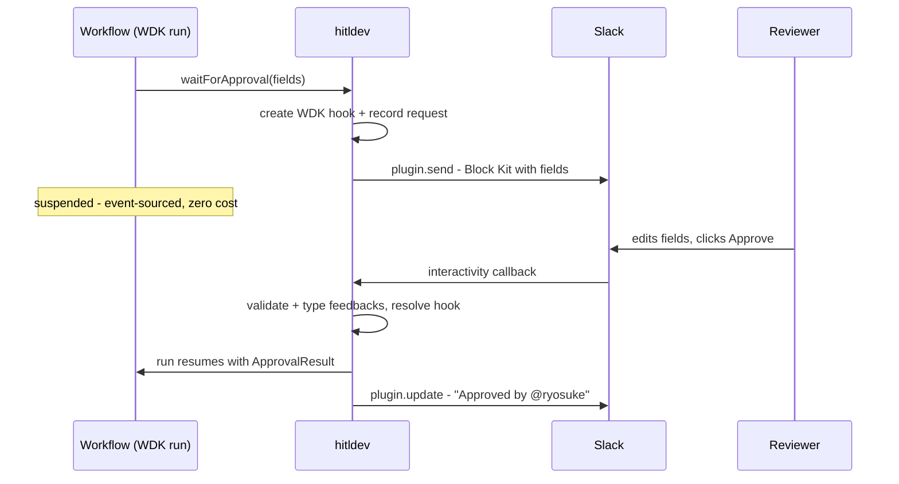

# hitldev

**Human-in-the-loop as a typed, durable primitive for TypeScript workflows.**

```ts
const approval = await waitForApproval({
  message: `Send this reply to ${input.email}?`,
  fields: {
    subject: field.textField({ label: "Subject", default: draft.subject }),
    body: field.textArea({ label: "Body", default: draft.body }),
  },
});
```

One `await`. The workflow suspends — for hours or days, at zero cost, surviving deploys and crashes. A reviewer gets the request in Slack, Teams, or a web inbox, edits the fields, and clicks approve. The workflow resumes with the edited, fully-typed values.

hitldev is **not an agent framework**. Bring your own — the [AI SDK](https://ai-sdk.dev), Mastra, or anything that runs inside a [Workflow DevKit](https://workflow-sdk.dev) workflow. hitldev does one thing: the human part.

> **Status: design phase.** This README is the design document. The API described here is the target interface; implementation follows it.

## Why

Agents that do real work — sending emails, posting messages, issuing refunds — need a human between the draft and the side effect. Everyone building this hits the same wall:

- **Approval is not a boolean.** Reviewers don't just approve or deny; they fix the subject line and rewrite a paragraph. The result must come back typed.
- **The wait is long.** Hours to days. The workflow must suspend durably — no polling loop, no state machine glued to a queue, no lost runs on redeploy.
- **Reviewers live in Slack and Teams**, not in your admin panel. But your workflow code shouldn't know or care which.
- **Existing options are a SaaS or DIY.** Hosted approval services own your data and your flow; hand-rolled Slack glue (interactivity endpoints, payload parsing, state correlation) is the code everyone writes badly, twice.

hitldev is the missing library: open source, typed end-to-end, native to a durable execution engine.

## Design principles

1. **One primitive, done well.** `waitForApproval` (and its list form, `waitForBatchApprovals`) and `notify`. No agent abstraction, no workflow engine, no triggers, no deploy story. Compose it with what you already use.
2. **Typed feedbacks.** Field builders define what a reviewer can edit; `REVIEWED` results carry the edited values, typed by inference. The reviewer's edit is data, not a comment.
3. **Durable by construction.** Built on the engine's native suspension via a thin binding (Workflow DevKit hooks in v0): suspension is event-sourced, resumption survives restarts and deploys. hitldev adds no runtime of its own.
4. **Channel-agnostic.** Workflow code declares *what* needs review. Plugins — explicit instances with an `id` and their own token — decide *where* it renders and *how* it comes back.
5. **Thin by design.** A library, a few channel plugins, an inbox UI. No platform, no vault, no control plane. Nothing to operate beyond what you already run.

## Quick example

A Workflow DevKit workflow using the plain AI SDK for drafting and hitldev for the human step:

```ts
// workflows/inbound-lead.ts
import { z } from "zod";
import { generateObject } from "ai";
import { field, waitForApproval } from "@hitldev/sdk";
import { sendEmail } from "../lib/email";

export async function inboundLead(input: { email: string; message: string }) {
  "use workflow";

  const { object: draft } = await generateObject({
    model: "anthropic/claude-sonnet-4-5",
    schema: z.object({ subject: z.string(), body: z.string() }),
    prompt: `Draft a reply to this inbound lead:\n${input.message}`,
  });

  // Suspends the run until a human responds — days if necessary.
  const approval = await waitForApproval({
    channel: "lead-approvals",            // plugin id; defaults to the first configured plugin
    message: `Inbound lead: ${input.email}`,
    fields: {
      subject: field.textField({ label: "Subject", default: draft.subject }),
      body: field.textArea({ label: "Body", default: draft.body }),
    },
    timeout: "72h",
    reminder: [
      { after: "0s", message: `Original message:\n${input.message}` },
      { after: "24h", message: "Still waiting for review" },
    ],
  });

  if (approval.type === "DENIED" || approval.type === "TIMED_OUT") return;

  const { subject, body } =
    approval.type === "REVIEWED" ? approval.feedbacks : draft;

  await sendEmail({ to: input.email, subject, body });
}
```

Wire the plugins once, at the app edge:

```ts
// hitl.ts
import { createHitl } from "@hitldev/sdk";
import { discordHitl } from "@hitldev/discord";
import { slackHitl } from "@hitldev/slack";
import { teamsHitl } from "@hitldev/teams";
import { vercelWorkflowBinding } from "@hitldev/vercel-workflow";

export const hitlApp = createHitl({
  binding: vercelWorkflowBinding(),
  plugins: [
    slackHitl({
      id: "lead-approvals",
      channel: "#inbound-leads",
      token: process.env.SLACK_BOT_TOKEN,
    }),
    teamsHitl({
      id: "teams-approvals",
      target: { type: "channel", teamId: process.env.TEAMS_TEAM_ID!, channelId: process.env.TEAMS_CHANNEL_ID! },
      appId: process.env.MICROSOFT_APP_ID,
      appPassword: process.env.MICROSOFT_APP_PASSWORD,
      tenantId: process.env.MICROSOFT_APP_TENANT_ID,
    }),
    discordHitl({
      id: "discord-approvals",
      channelId: process.env.DISCORD_CHANNEL_ID!,
      token: process.env.DISCORD_BOT_TOKEN,
      publicKey: process.env.DISCORD_PUBLIC_KEY,
    }),
  ],
});

// Mount the callback handler (Slack interactivity, Teams Bot Framework, Discord interactions, webui inbox API) into your app:
// Express:  app.use("/hitl", hitlApp.handler)
// Hono:     app.route("/hitl", hitlApp.hono)
// Next.js:  export const { GET, POST } = hitlApp.routeHandlers
```

Plugins are explicit instances: secrets are plain `process.env` references passed right here, and the same platform can be wired multiple times (two Slack workspaces, an approvals channel and an alerts channel, ...). Workflow code refers to plugins only by `id`. The `binding` picks the durable execution engine (see [Engine bindings](#engine-bindings)). No other configuration exists.

## API

### `waitForApproval`

```ts
const approval = await waitForApproval({
  message: string,
  fields?: Record<string, HitlField>,  // fields the reviewer can edit
  channel?: string,                       // plugin id; defaults to the first configured plugin
  timeout?: Duration,                     // e.g. "72h"; resolves as { type: "TIMED_OUT" }
  reminder?: ReminderEntry[],            // remind / escalate while pending (see below)
});
```

While pending, `reminder` entries fire on a durable timer:

```ts
reminder: [
  { after: "24h", message: "Still waiting for review" },           // same-channel thread remind
  { after: "48h", channel: "oncall", message: "Unanswered" },      // escalate (notify fallback channel)
  { after: "48h", channel: "oncall", mode: "redeliver" },          // escalate (re-send approval UI)
]
```

- `{ after, message? }` — threaded remind on the approval channel (`message` defaults to `"Reminder: approval still pending"`)
- `{ after, channel, message?, mode? }` — escalate to another plugin id (`mode` defaults to `"notify"`)

The result is a discriminated union, with `feedbacks` typed by the field definitions:

```ts
type ApprovalResult<F> =
  | { type: "APPROVED"; id: string; by?: Reviewer }
  | { type: "DENIED"; id: string; by?: Reviewer; reason?: string }
  | { type: "REVIEWED"; id: string; by?: Reviewer; feedbacks: F }  // approved with edits
  | { type: "TIMED_OUT"; id: string };
```

Under the hood, `waitForApproval` is a Workflow DevKit hook: the workflow suspends, the plugin delivers the request, and the human's response resolves the hook and resumes the run — across restarts and deploys.

### `waitForBatchApprovals`

The list form of `waitForApproval`: deliver many approvals as **one message**, reviewed and submitted together.

```ts
const results = await waitForBatchApprovals({
  title: "Outbound emails",
  fields: {
    subject: field.textField({ label: "Subject", default: "Hi" }),
  },
  items: [
    { message: "Email to ACME", defaults: { subject: "Hello ACME" } },
    { message: "Email to Globex" },   // uses the shared field defaults
  ],
  channel: "lead-approvals",
  timeout: "72h",                      // one timeout for the whole batch
  reminder: [{ after: "24h" }],        // reminders/escalation are batch-level too
});
// results: ApprovalResult<{ subject: string }>[], in item order
```

- **Shared field schema.** `fields` is defined once for the whole batch; each item overrides initial values via `defaults`. Every result's `feedbacks` is typed by the same schema.
- **One submit.** The reviewer picks approve/deny per item (and edits fields where the channel supports it), then submits once — one callback resolves the whole batch. Items resolve independently: the same submit can produce `APPROVED`, `DENIED`, and `REVIEWED` results side by side.
- **All-items completion.** The workflow suspends until every item is resolved and returns results in input order. On `timeout`, items already resolved keep their result; the rest become `TIMED_OUT`.
- **Fallback delivery.** Channels that can't render the batch as one message (no `sendBatch`, or `canSendBatch` returns `false` — e.g. over the channel's size limits) receive one regular approval message per item; the batch still waits for all of them.

Channel limits: Slack renders up to the 50-block message limit (roughly 15 items with one field); Teams up to the ~28 KB card limit; Discord renders field-less batches of up to 25 items as a multi-select + Submit (batches **with** fields fall back to per-item delivery, where edits use the modal).

### Field builders

```ts
field.textField({ label, default? })
field.textArea({ label, default? })
field.select({ label, options, default? })
field.confirm({ label, default? })
```

Each field renders natively per channel (Slack Block Kit inputs, Teams Adaptive Card fields, web form controls) and contributes its type to `feedbacks`.

### `notify`

Fire-and-forget progress updates and threaded context:

```ts
await notify({ message: string, parent?: string, channel?: string });
```

### Plugin interface

Workflow code declares intent; a plugin — instantiated in `createHitl`, never imported by workflow code — owns rendering and callbacks:

```ts
interface HitlPlugin {
  id: string;   // routing key used by waitForApproval({ channel }) / notify({ channel })
  // Render and deliver an approval request (Slack Block Kit message,
  // Teams Adaptive Card, email with a link to the web inbox, ...)
  send(request: ApprovalRequest): Promise<{ externalId: string }>;
  // Reflect resolution back into the channel (e.g. replace buttons with "Approved by @ryosuke")
  update?(externalId: string, result: ApprovalResult): Promise<void>;
  notify(notification: Notification): Promise<void>;
  // Parse inbound interaction callbacks (Slack interactivity payloads etc.)
  // The runtime resolves the matching Workflow DevKit hook, resuming the workflow.
  // A batch submit comes back as one HitlBatchCallback carrying every item's decision.
  handleCallback?(req: Request): Promise<HitlCallback | HitlBatchCallback | null>;
  // Batch capability (optional): render a whole batch as a single message.
  // Absent sendBatch — or canSendBatch returning false — makes the core
  // fall back to one send() per item.
  sendBatch?(request: BatchApprovalRequest): Promise<{ externalId: string }>;
  canSendBatch?(request: BatchApprovalRequest): boolean;
  updateBatch?(externalId: string, results: ApprovalResult[]): Promise<void>;
}
```

Official plugins:

| Plugin | Package | Renders as |
|---|---|---|
| `slackHitl()` | `@hitldev/slack` | Block Kit message with input fields and approve/deny buttons |
| `discordHitl()` | `@hitldev/discord` | Embed message with approve/deny buttons; feedback fields open in a Modal |
| `teamsHitl()` | `@hitldev/teams` | Adaptive Card with input fields and approve/deny actions |
| `webui()` | built into `hitldev` | Approval inbox (React components from `@hitldev/ui`) |

One package per channel — install only what you use. Writing your own plugin is implementing the interface above.

### `createHitl`

The single wiring point. Takes the plugin list, returns mountable handlers:

```ts
const hitlApp = createHitl({ plugins: [...] });

hitlApp.handler        // Node/Express-style handler
hitlApp.hono           // Hono sub-app
hitlApp.routeHandlers  // Next.js route handlers
```

The handler serves: channel callbacks (e.g. Slack interactivity), the inbox API (`GET /approvals`, used by the webui plugin and available for your own integrations), and approval audit lookups.

## How it works



What hitldev **owns** (all thin, bounded pieces):

| Piece | What it is |
|---|---|
| `hitl` core | `waitForApproval` / `notify` / field builders / result types, on top of the engine binding |
| Engine bindings | One small package per engine (`@hitldev/vercel-workflow`, ...) implementing `EngineBinding` |
| Plugins | Slack / Teams / webui renderers and callback parsers |
| Inbox UI | React components: pending approvals, request detail, audit trail |
| Approval store | The `Store` interface for pending/resolved requests (powers the inbox and audit). In-memory by default; `@hitldev/store-postgres` and `@hitldev/store-sqlite` for persistence |

What it **deliberately does not own**:

- Durable execution, suspension, replay → **the engine** (Workflow DevKit in v0; see [Engine bindings](#engine-bindings))
- Agents, LLM calls, tools → **AI SDK** (or Mastra, or anything else)
- Deployment, secrets, versioning → **your app and your platform**

## Engine bindings

hitldev asks very little of the execution engine — exactly four things:

1. **Suspend with a token** (workflow side): create a durable wait and obtain an opaque resume token
2. **Resolve by token** (callback side): an external process resumes the wait with a payload
3. **A durable timer** (for `timeout`)
4. **A durable step** (workflow side): run non-deterministic IO (record the request, `plugin.send`) memoized across replays

Every major durable execution engine has native primitives for all four:

| Engine | Suspend | Resume | Timeout | Step |
|---|---|---|---|---|
| Workflow DevKit (v0) | `createHook()` | `resolveHook(token, payload)` | `sleep()` + race | pass-through (workflow code may do IO) |
| Temporal | signal + `condition()` | `handle.signal(workflowId, payload)` | `condition(pred, timeout)` | activity |
| Inngest | `step.waitForEvent(...)` | `inngest.send(event)` with correlation | built-in (null → `TIMED_OUT`) | `step.run` |
| Restate | `ctx.awakeable()` | `resolveAwakeable(id, payload)` | `ctx.sleep` + race | `ctx.run` |

The architecture is split along that contract:

- **Core (engine-agnostic):** approval store, field builders, `ApprovalResult` typing and validation, plugin interface, `createHitl` callback handling, and the approval flow itself (`requestApproval`), which performs all IO through the binding's step primitive. The bulk of the code; knows nothing about engines.
- **Binding (per engine, thin):** the `EngineBinding` interface, implemented by a dedicated package and passed to `createHitl({ binding })`. The *workflow side* is `suspend` / `sleep` / `run` — create the engine-native wait, run IO as durable steps. The *resolver side* is one function, `resolve(token, result)`, called by `createHitl` when a callback arrives — `resumeHook` for WDK, a signal for Temporal, an event for Inngest, `resolveAwakeable` for Restate.

The resume token is **opaque to the core**: for Temporal it encodes `{ workflowId, signalId }`, for Inngest a correlation key. The core just stores it and hands it back. Differences that can't be absorbed surface honestly in the API — e.g. Inngest has no ambient workflow context, so its package ships its own entrypoint taking the step (`waitForApproval(step, opts)`), built from the exported `requestApproval` + `getRuntime`.

Switching engines means switching one import (`@hitldev/vercel-workflow` → `@hitldev/temporal`) and the `binding` entry in `createHitl`. Plugins, the approval store, the inbox — all shared. v0 ships the Workflow DevKit binding (`@hitldev/vercel-workflow`) only; the binding interface exists from day one so the others stay an honest estimate of 50–100 lines each.

## Requirements and setup

- Your code runs inside Workflow DevKit workflows — on Vercel (Vercel world, zero config) or self-hosted (`@workflow/world-postgres`).
- hitldev needs a store for approvals. `createHitl` defaults to the in-memory store; pass a `@hitldev/store-postgres` or `@hitldev/store-sqlite` store for persistence.
- **Custom `Store` implementations:** batch support added four methods to the `Store` interface (`createBatch`, `getBatch`, `setBatchExternalId`, `listByBatch`) and two columns plus a companion `<table>_batches` table to the SQL schema (migration `003_batches`, applied automatically by the bundled stores). Custom stores must implement them; `describeStoreContract` from `@hitldev/sdk/store-contract` covers the expected behavior.
- **SQLite** — schema is created automatically in the constructor; no extra step:

```ts
import { DatabaseSync } from "node:sqlite";
import { SqliteStore } from "@hitldev/store-sqlite";

const store = new SqliteStore(new DatabaseSync("hitldev.db"));
```

- **Postgres** — call `ensureSchema()` once at startup, or apply the exported `schemaSql()` through your own migration tool:

```ts
import pg from "pg";
import { PostgresStore } from "@hitldev/store-postgres";

const pool = new pg.Pool({ connectionString: process.env.DATABASE_URL });
const store = new PostgresStore(pool);
await store.ensureSchema();
```

- **Self-hosted Postgres** — one command creates the hitldev approvals table and runs WDK world migrations (when `@workflow/world-postgres` is installed):

```bash
DATABASE_URL=postgres://... npx hitldev setup
```

  Use `npx hitldev schema` to print idempotent DDL for your migration pipeline (`--dialect postgres|sqlite`, `--table hitldev.approvals`).

- Local dev: the `webui()` plugin works with zero external services — approve from a local inbox page, no Slack required.

### Discord setup

1. Create an application in the [Discord Developer Portal](https://discord.com/developers/applications) and add a bot.
2. Enable **Send Messages** and **Message Content Intent** (if reading message content).
3. Copy the bot token to `DISCORD_BOT_TOKEN` and the application **Public Key** to `DISCORD_PUBLIC_KEY`.
4. Set **Interactions Endpoint URL** to your mounted hitl handler (e.g. `https://your-app.example/hitl`). Discord sends a PING on save; `@hitldev/discord` responds automatically.
5. Invite the bot to your server and pass the target channel id as `channelId`.

When a reviewer clicks **Approve** and the request has feedback fields, Discord opens a Modal to collect edits before resolving the approval.

Batches (`waitForBatchApprovals`) render as a multi-select (every item preselected = approve) plus a **Submit** button, for up to 25 field-less items. Discord has no message-level form, so batches **with** fields fall back to per-item delivery automatically — edits then use the modal as usual.

### Teams setup

1. Register a bot in [Azure Bot Service](https://portal.azure.com/#create/Microsoft.AzureBot) and enable the **Microsoft Teams** channel.
2. Copy the **Microsoft App ID** and a client secret to `MICROSOFT_APP_ID` / `MICROSOFT_APP_PASSWORD`.
3. Set the **Messaging endpoint** to your mounted hitl handler (e.g. `https://your-app.example/hitl`).
4. Package and install the Teams app (see [packages/teams/manifest.json](packages/teams/manifest.json)) in the target team and/or for individual reviewers.
5. Pass `teamId` + `channelId` for channel approvals, or a reviewer's Azure AD object id for 1:1 DM approvals.

Teams renders feedback fields inline in the Adaptive Card — no modal step is needed. Batches render as one card with per-item inputs and a single **Submit**; batches over the ~28 KB card limit fall back to per-item delivery.

## Packages

| Package | Contents |
|---|---|
| `@hitldev/sdk` | Core: `waitForApproval`, `waitForBatchApprovals`, `notify`, `field.*` field builders, `createHitl`, `webui()` plugin, inbox API, `Store` interface + `InMemoryStore` |
| `@hitldev/vercel-workflow` | `vercelWorkflowBinding()` — Workflow DevKit engine binding |
| `@hitldev/store-postgres` | `PostgresStore` — bring your own pg-compatible pool |
| `@hitldev/store-sqlite` | `SqliteStore` — `node:sqlite`, zero dependencies |
| `@hitldev/cli` | `hitldev setup` / `hitldev schema` — Postgres setup and DDL export |
| `@hitldev/slack` | `slackHitl()` |
| `@hitldev/discord` | `discordHitl()` |
| `@hitldev/teams` | `teamsHitl()` |
| `@hitldev/ui` | Inbox React components |

## Roadmap

- **More channels** — email (approve via magic link)
- **Engine bindings** — `@hitldev/temporal`, `@hitldev/inngest`, `@hitldev/restate`, Cloudflare Workflows (see [Engine bindings](#engine-bindings) for the contract)
- **Approval policies** — multi-approver, quorum, role routing, auto-approve rules (batched lists ship today as `waitForBatchApprovals`)
- **Escalation** — SLA timers, reminder nudges (`waitForApproval({ reminder })`), fallback channels
- **Audit export** — approval history as structured logs
- **hitldev Cloud (hosted relay)** — a hosted server that owns the platform integrations, replacing per-platform setup with one `cloud({ apiKey })` plugin. One-click OAuth installs instead of hand-built Slack/Azure/Discord apps; resolutions delivered to your app as normalized, HMAC-signed callbacks at `.well-known/hitldev/v1/webhook/:token`; `hitldev listen` forwards them to localhost during development. Implements the same `HitlPlugin` interface and event schema as the in-process plugins — the relay is an alternative transport, not a fork. Library mode stays primary and fully self-contained.

## Repository layout

```
packages/
  sdk/              # @hitldev/sdk (core: waitForApproval, notify, field builders, createHitl, webui)
  vercel-workflow/  # @hitldev/vercel-workflow (Workflow DevKit engine binding)
  store-postgres/   # @hitldev/store-postgres (PostgresStore)
  store-sqlite/     # @hitldev/store-sqlite (SqliteStore on node:sqlite)
  cli/              # @hitldev/cli (hitldev setup / schema)
  slack/            # @hitldev/slack
  discord/          # @hitldev/discord
  teams/            # @hitldev/teams
  ...               # @hitldev/ui follows as it is implemented
```
