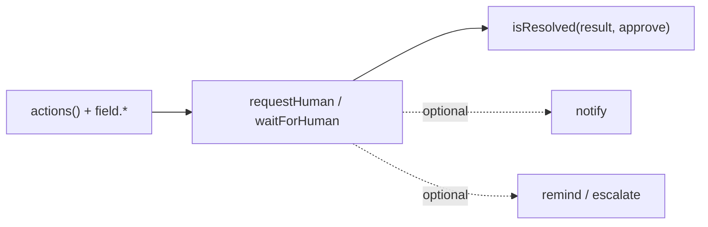

# Foundations

Hitl SDK splits into two import layers. Use the right one in workflow functions.

| Layer | Import from | APIs |
|-------|-------------|------|
| **Workflow client** | `lib/hitl-client.ts` | `requestHuman`, `waitForHuman`, `notify` |
| **SDK helpers** | `@hitl-sdk/hitl` | `actions`, `field`, `remind`, `escalate`, `isResolved` |

The workflow client is a thin HTTP wrapper over your engine's `suspend()` / `sleep()`. It POSTs to your server's internal API; state and channel delivery live only on the server (`new Hitl({ … })`).

## One call vs create + wait

**One call** creates and waits in a single step:

```typescript
const result = await waitForHuman({ message: "Approve?", actions, timeout: "72h" });
```

**Create + wait** splits creation and waiting when you need to send context in between:

```typescript
const pending = await requestHuman({ message: "Approve?", actions });
await notify({ after: pending, message: "Extra context for the reviewer" });
const result = await waitForHuman(pending, { reminders: [remind.after("1h")] });
```

Use create + wait when reviewers need follow-up messages, multi-step timelines, or logic between creation and waiting.

## API reference

| Page | What it covers |
|------|----------------|
| [Human steps](/docs/foundations/human-steps) | `requestHuman`, `waitForHuman`, one-shot vs create+wait, batch mode |
| [Actions and fields](/docs/foundations/actions-and-fields) | `actions()`, `field.*`, `isResolved`, typed results |
| [Notifications](/docs/foundations/notifications) | `notify`, `TimelineAnchor`, thread chaining |
| [Timeouts & reminders](/docs/foundations/timeouts-and-reminders) | `timeout`, `remind.*`, `escalate.to()` schedules |

## Typical flow



See also: [Overview](/docs/overview) for architecture, [Quickstart](/docs/quickstart) for a full end-to-end loop.
