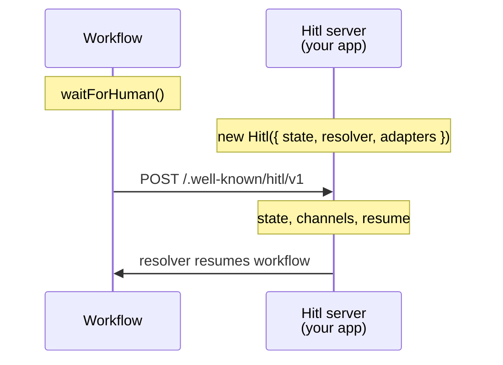
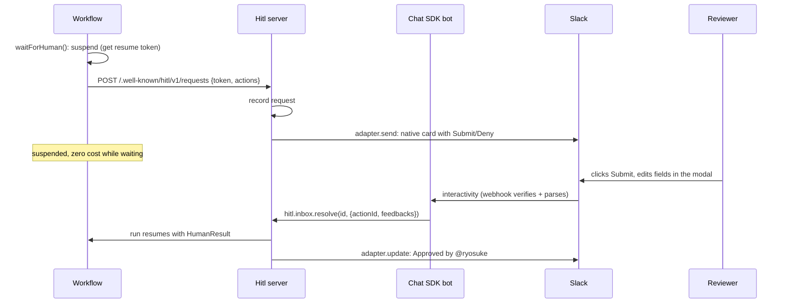

# Overview

Hitl SDK adds human approval to AI agents and durable workflows with a single `waitForHuman` call. Workflows suspend until a reviewer approves, denies, or edits fields, then resume with typed results.

## What you get

- **Small workflow API**: `waitForHuman` is the core call. Pass `remind` and `escalate` on the wait for schedules.
- **Workflow engine agnostic**: Workflow SDK, Temporal, or Inngest
- **Channel agnostic**: built-in web inbox plus optional Chat SDK adapter (Slack, Teams, Discord, and [more](https://chat-sdk.dev/adapters))
- **Database agnostic**: in-memory (dev), SQLite, Postgres, or Redis

## Two-process architecture

Durable workflows **replay from an event log**. If a worker crashes or redeploys mid-run, the engine restarts the workflow from recorded steps instead of losing in-flight work. Side effects (posting to Slack, writing to Postgres, handling webhooks) must not run inside workflow code, or they fire again on every replay and break determinism. Human approval also waits hours or days. The run should stay **suspended at zero cost**, not hold connections or run background IO in the workflow sandbox.

Hitl therefore splits into two processes with a narrow boundary:

- **Workflow process**: `waitForHuman()` suspends the run, then makes a **durable HTTP POST** to your server. No state backend, no adapters, no channel SDKs on this side.
- **Server process**: your app with `new Hitl({ state, resolver, adapters })`. Records requests, delivers to inbox / Slack / Teams, accepts reviewer input, and calls your engine's **resolver** to resume the run.

The only link between them is HTTP to `.well-known/hitl/v1`. That split buys you:

- **Replay-safe approval steps**: workflow code never touches channels or databases directly
- **Failure tolerance**: the create-request POST and timeout/reminder sleeps are **durable steps** memoized by the engine, so replay does not duplicate Slack posts or inbox rows. Pending requests live in your server state until someone resolves or times out, even if the workflow sandbox restarts.
- **Cheap long waits**: the engine suspends until a human acts or a timeout/reminder fires
- **Engine portability**: Swap Workflow SDK, Temporal, or Inngest by changing only the workflow client import and the `resolver` in `new Hitl()`. Your state backend, channel adapters, and inbox setup stay the same.
- **Channel portability**: add or change Slack, web inbox, or other adapters on the server without editing workflow functions

- **Workflow side**: engine-specific client (`createWorkflowSdkHitlClient`, etc.). Suspend, sleep, and durable HTTP only.
- **Server side**: `new Hitl({ state, resolver, adapters })`. Persistence, delivery, inbox, and resume.

The workflow never talks to Slack, Postgres, or your inbox UI directly. The next section shows what happens inside the server between POST and resume.

## End-to-end approval flow

Inside those two processes, a single `waitForHuman` call looks like this. Slack via Chat SDK is shown below. With the [web inbox](/docs/channels/web-inbox), channel participants are skipped and resolution happens through `hitl.inbox` in the browser.

The server handles everything between the POST and the resume: persistence, delivery, and calling your workflow engine's resolver when a human decides.

## Supported matrix

| Axis | Options |
|------|---------|
| Workflow engine | [Workflow SDK](https://workflow-sdk.dev), [Temporal](https://temporal.io), [Inngest](https://www.inngest.com) |
| State | in-memory, SQLite, Postgres, Redis |
| Delivery | web inbox (built in), Chat SDK adapter |
| Host | any Node HTTP server. See [Host integration](/docs/host-integration) |

## Next steps

Follow the [Quickstart](/docs/quickstart) to run a complete approval loop end-to-end. If you already know your stack, skip to [Install](/docs/install) to pick packages, then jump to the relevant axis pages.
