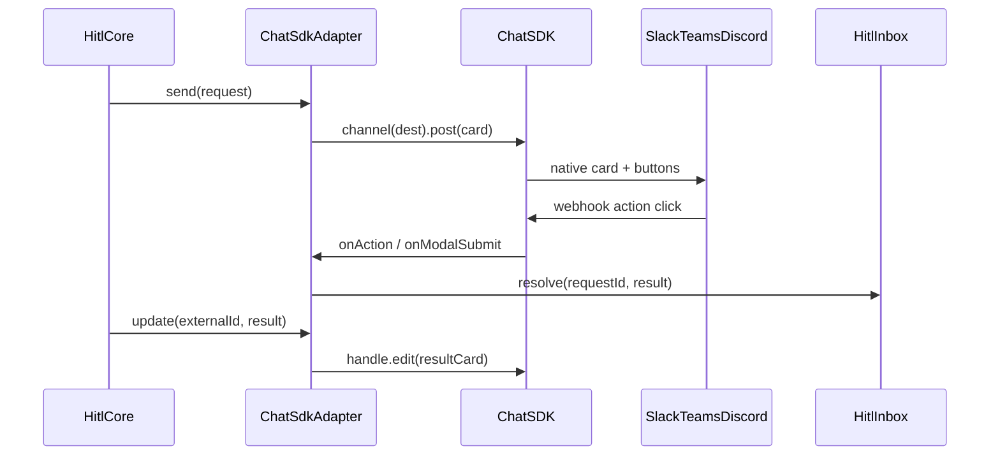

# @hitl-sdk/adapter-chat-sdk — architecture

Thin `HitlAdapter` implementation over the [Vercel Chat SDK](https://chat-sdk.dev). The Chat SDK owns webhook verification, payload parsing, and platform-native rendering; this package maps hitl's adapter contract to Chat SDK cards, modals, and handler callbacks.

## Data flow



## HitlAdapter mapping

| Method | Behaviour | Implemented in |
|---|---|---|
| `send` | Posts an approval card (message + Approve/Deny buttons carrying the request id) to the resolved destination, or inside an existing thread when `threadRef` is set; keeps the `SentMessage` handle in memory for `update`. | `index.ts` |
| `update` | Edits the card in place to show the outcome once resolved. | `index.ts`, `render.tsx` |
| `notify` | Posts to the resolved destination (or threads under a parent when `threadRef` is set) and returns an encoded `externalId` so later `waitForHuman({ after: await notify(...) })` can chain in the same thread. | `index.ts`, `external-id.ts` |

The hitl core passes an opaque `destination` string; this adapter resolves it to `bot.channel(destination ?? defaultChannel)`.

### Batches

No dedicated batch UI. Without `sendBatch`, the core delivers each item on its own, so every item goes through the same card + modal flow.

## Handler registration

`registerHitlHandlers` wires the shared `bot` to `hitl.inbox`:

- **`bot.onAction`** — handles `hitl:{actionId}` button clicks. The request id rides in the button `value`. If the action has feedback fields, opens a modal instead of resolving immediately.
- **`bot.onModalSubmit`** — handles `hitl:modal:{actionId}` callbacks. Parses field values and calls `inbox.resolve` with `feedbacks`.

A `WeakSet` ensures multiple `createChatSdkAdapter` instances sharing one `bot` register handlers only once. The inbox is resolved lazily (`() => hitl.inbox`) because `new Hitl()` needs adapters before the inbox exists.

## Destination routing

| Routing key | Resolved destination |
|---|---|
| `approvals` (adapter id only) | `defaultChannel` on the adapter |
| `approvals:slack:C456` | `slack:C456` (opaque string passed through to `bot.channel`) |

`resolveDestination` throws when neither `request.destination` nor `defaultChannel` is set.

## Feedback fields and modals

Chat SDK cards cannot hold inline text inputs. Any action with fields (`textField` / `textArea` / `select` / `confirm`) uses a two-step flow on every platform:

1. User clicks the action button → `event.openModal(actionModalFromRequest(...))`
2. User submits the modal → `inbox.resolve` with parsed `feedbacks`

Modal title, submit, and close labels come from each action's `label`, `submitLabel`, and `closeLabel` (submit defaults to `label`). `needsModal` is true when `actionFields(def)` is non-empty.

## externalId encoding

The hitl core hands adapters only an opaque `externalId` string on `update` / thread chaining. This adapter packs the Chat SDK channel ref and message id into one value:

```
slack:C123#msg_abc
```

Channel refs contain `:` (e.g. `slack:C123`), so the separator is `#`, which channel and message ids do not use. `toChatThreadRef` accepts either the encoded form or a native Chat SDK thread ref (`channel:messageId`).

## JSX

Cards and modals are authored as JSX compiled by the Chat SDK runtime. This package sets `jsxImportSource: "chat"` in its `tsconfig.json`; if you fork the renderer, mirror that in your build (and in vitest's `esbuild` options).

## File layout

```
src/
  index.ts       createChatSdkAdapter
  actions.ts     registerHitlHandlers, action/modal event handlers
  render.tsx     humanRequestCard, actionModal, resultCard
  fields.tsx     needsModal, fieldInputs, parseModalValues
  external-id.ts encode/decode externalId, threadRef helpers
  constants.ts   hitl: action/callback id prefixes
```

## Caveats

- **`update` handle lifetime** — relies on the in-process `SentMessage` handle stored in a `Map`. After a server restart the handle is gone and `update` becomes a no-op. The approval still resolves; only the in-place card edit is skipped. This matches the behaviour of the previous per-platform adapters.
