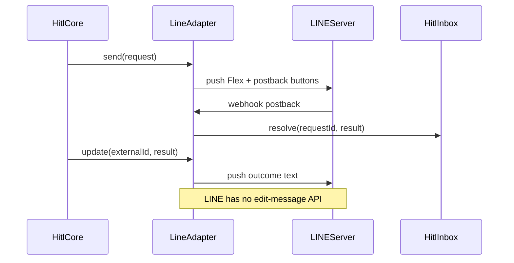

# @hitl-sdk/adapter-line — architecture

Native `HitlAdapter` over the [LINE Messaging API](https://developers.line.biz/en/docs/messaging-api/) via [`@line/bot-sdk`](https://github.com/line/line-bot-sdk-nodejs). Flex Messages replace Chat SDK cards; postback webhooks replace `bot.onAction`.

## Data flow



## HitlAdapter mapping

| Method | Behaviour | Implemented in |
|---|---|---|
| `send` | Push Flex approval bubble with postback (or LIFF URI) action buttons | `adapter.ts`, `render.ts` |
| `update` | Push follow-up text with outcome | `adapter.ts`, `render.ts` |
| `notify` | Push plain text; returns encoded `externalId` | `adapter.ts` |
| `fetch` | LIFF feedback GET/POST at fixed path (when `feedbackSecret` set) | `adapter.ts`, `feedback.ts` |

## HTTP routes

### LIFF feedback (fixed path, hitl-managed)

When `feedbackSecret` is configured, the adapter sets `channelKey: "line"` and handles:

```
/.well-known/hitl/v1/channels/line/feedback
```

Hitl core delegates `/.well-known/hitl/v1/channels/{channelKey}/*` to the matching adapter's `fetch`. Mount on Express:

```ts
app.all("/.well-known/hitl/v1/*", (req, res) => {
  void hitl.handler(req, res);
});
```

| Method | Behaviour |
|---|---|
| GET | LIFF form HTML (`token` query param) |
| POST | Validate token + feedbacks, `inbox.resolve` |

Submit URL in the form HTML is the same fixed `LINE_FEEDBACK_PATH` constant.

Register the LIFF app Endpoint URL in LINE Developers Console to match.

### Messaging API webhook (user-defined path)

Postback events are **not** routed through `adapter.fetch`. Add hitl to the webhook you already mount and register in LINE Console.

**Recommended:** branch on `parsePostback` inside your existing `line.middleware` handler:

```ts
if (event.type === "postback") {
  if (parsePostback(event.postback.data)) {
    await handlePostbackEvent(event, { client, inbox: hitl.inbox });
  } else {
    await handleMyPostback(event);
  }
}
```

`parsePostback` returns a payload only for hitl Flex buttons.

**Fetch-based hosts:** `createLineWebhookHandler` validates the signature from a raw `Request` body (Next.js, Hono, etc.). Hitl postbacks are handled first; optional `onFallbackEvent` covers messages and custom postbacks (same branching as Express).

Postback behaviour:

- **No fields** — postback resolves immediately via `inbox.resolve`
- **Inline select/confirm** — first postback pushes a field-step Flex; second postback resolves with `feedbacks`
- **LIFF fields** — action button opens LIFF; feedback resolves via `adapter.fetch` POST

## Namespace

| Key | Example | Purpose |
|---|---|---|
| `HitlAdapter.id` | `line-approvals` | `waitForHuman({ channel })` routing |
| `HitlAdapter.channelKey` | `line` | HTTP path under `/v1/channels/` |

## Destination routing

| Routing key | Resolved destination |
|---|---|
| `line-approvals` (adapter id only) | `defaultChannel` on the adapter |
| `line-approvals:user:U456` | `user:U456` |

Push API `to` is the id after the prefix (`U456`, `C456`, `R456`).

## externalId encoding

```
user:U123#msg_abc
```

The separator is `#` because destination refs contain `:`.

## File layout

```
src/
  adapter.ts     createLineAdapter + channel fetch
  webhook.ts     createLineWebhookHandler
  postback.ts    postback event routing
  feedback.ts    LIFF tokens + feedback handlers
  render.ts      Flex message builders
  fields.ts      inline vs LIFF field routing
  destination.ts parse user:/group:/room: refs
  external-id.ts encode/decode externalId
  constants.ts   postback schema + LINE_FEEDBACK_PATH
  client.ts      LineMessagingClient + push helper
```

## Caveats

- **`update` after restart** — in-process `sent` map is lost; outcome push still works when destination can be decoded from `externalId`
- **LIFF Console** — Endpoint URL must match `LINE_FEEDBACK_PATH` on your domain
- **Webhook Console** — Webhook URL is user-chosen; add `parsePostback` / `handlePostbackEvent` to your existing handler
- **Postback data limit** — LINE postback `data` is capped at 300 characters; payloads use compact JSON keys
