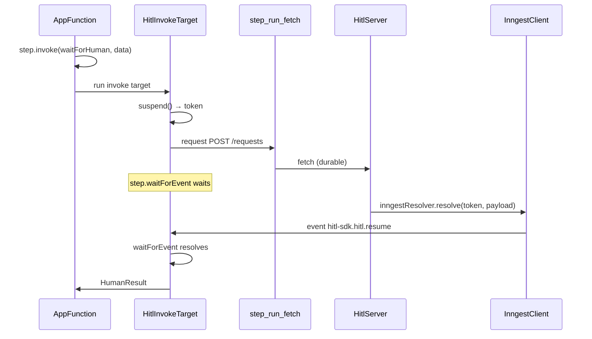

# @hitl-sdk/resolver-inngest — architecture

Thin binding over hitl's engine contract (`WorkflowPrimitives` + `HitlResolver` from `@hitl-sdk/hitl/core`). State, adapters, and HTTP live on the server; function code calls hitl through Inngest invoke targets.

## Data flow



## Engine mapping

| hitl primitive | Inngest API | Implemented in |
|---|---|---|
| `suspend` | `step.waitForEvent` + CEL `if` | `createInngestHitlClient` |
| `sleep` | `step.sleep` | `createInngestHitlClient` |
| `request` | `step.run` + `fetch` | `createInngestHitlClient` (default) or caller override |
| `resolve` | `client.send(event)` | `inngestResolver` |
| app wiring | `step.invoke(function, data)` | `createHitlInngestFunctions` |

Timeout and reminder paths are handled by the shared `createHitlClient` logic: `step.sleep` fires, then the client POSTs to `/timeout`. The `waitForEvent` timeout is not used for real timeouts (see below).

## Two halves

### Workflow side — `createHitlInngestFunctions` (recommended)

Registers three Inngest functions and returns them for `step.invoke`:

| Export | Function ID | Role |
|---|---|---|
| `waitForHuman` | `@hitl-sdk/hitl/wait-for-human` | create + wait; returns `HumanResult` |
| `requestHuman` | `@hitl-sdk/hitl/request-human` | create only; returns `{ id, batch? }` |
| `notify` | `@hitl-sdk/hitl/notify` | send notification; returns `{ id }` |

```ts
const { waitForHuman, requestHuman, notify } = createHitlInngestFunctions(inngest);

// in a handler
await step.invoke("approve", { function: waitForHuman, data: { message, actions, timeout } });
```

Register all three in your serve `functions` array. Each invoke target creates its own `createInngestHitlClient({ step })` for the duration of that run.

### Workflow side — `createInngestHitlClient` (low-level)

Wraps `createHitlClient` with Inngest step tools from the current handler:

```ts
return createHitlClient({
  suspend<T>() {
    const token = `hitl-wait-${++waitCounter}`;
    const promise = step
      .waitForEvent(token, {
        event,
        timeout: "100y",
        if: `async.data.token == '${token}'`,
      })
      .then((received) => {
        if (!received) return new Promise<T>(() => {});
        return received.data.payload as T;
      });
    return { token, promise };
  },
  sleep(ms) {
    return step.sleep(`hitl-timer-${++sleepCounter}`, `${ms}ms`);
  },
  request: options.request ?? defaultStepRunFetch,
  // ...
});
```

- **`step.waitForEvent`** — durable wait correlated by token. Inngest requires a timeout; hitl sets `"100y"` because real `timeout` / `reminders` are implemented via `step.sleep`, not `waitForEvent` expiry.
- **Null handling** — when `waitForEvent` returns `null` (its own timeout), the promise stays pending forever. Timeout/reminder code paths exit through `step.sleep` + `/timeout` instead.
- **`request`** — built-in by default (`hitl-fetch-N` step IDs). Override for custom fetch or tests.

### Server side — `inngestResolver`

Sends a resume event the invoke target's `waitForEvent` is listening for:

```ts
await options.client.send({
  name: event,
  data: { token, payload },
});
```

Default event name: `hitl-sdk.hitl.resume` (`HITL_RESUME_EVENT`). Override with the `event` option on both `createHitlInngestFunctions` and `inngestResolver` if needed.

Runs in plain Node (API route, serverless handler, etc.) — not inside Inngest function handlers.

## Token format

The core treats the token as opaque. This binding uses a deterministic counter scoped to one function run:

```
hitl-wait-1
hitl-wait-2
…
```

Correlation happens in two places:

1. **POST `/requests`** — token stored by hitl server
2. **`waitForEvent` CEL** — `async.data.token == 'hitl-wait-N'` selects the matching event

On resolve, `inngestResolver` sends `{ token, payload }` in the event data; the handler's `waitForEvent` filter matches and returns `received.data.payload`.

## Event design

| Constant | Value |
|---|---|
| `HITL_RESUME_EVENT` | `hitl-sdk.hitl.resume` |
| `HITL_WAIT_FOR_HUMAN_EVENT` | `hitl-sdk.function.wait-for-human` |
| `HITL_REQUEST_HUMAN_EVENT` | `hitl-sdk.function.request-human` |
| `HITL_NOTIFY_EVENT` | `hitl-sdk.function.notify` |

All suspensions share one event name; the token in `data` correlates the resume (same idea as Temporal's shared `hitl-resume` signal with `waitToken` in the payload).

## File layout

```
src/
  constants.ts   function IDs
  events.ts      event names + typed payloads
  client.ts      createInngestHitlClient
  functions.ts   createHitlInngestFunctions
  index.ts       re-exports
  resolver.ts    inngestResolver
```

## Comparison with other bindings

| | Workflow DevKit | Inngest | Temporal |
|---|---|---|---|
| Suspend | `createHook()` | `step.waitForEvent` | signal + `condition()` |
| Timer | `sleep()` | `step.sleep` | `sleep(ms)` |
| Request | `"use step"` fetch | `step.run` fetch | activity fetch |
| Resolve | `resumeHook(token)` | `client.send(event)` | `handle.signal(name, …)` |
| Token | WDK hook token | `hitl-wait-N` | `{ workflowId, waitToken }` JSON |
| App wiring | module-level client | `step.invoke` on registered functions | module-level client + activity |
