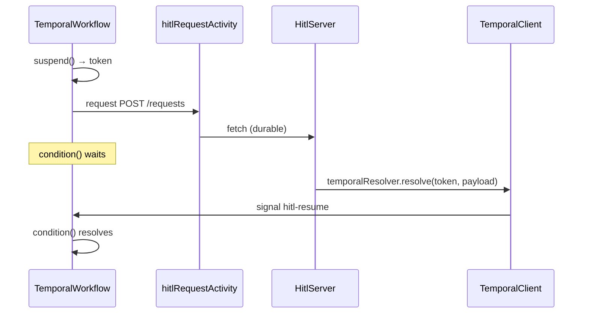

# @hitl-sdk/resolver-temporal — architecture

Thin binding over hitl's engine contract (`WorkflowPrimitives` + `HitlResolver` from `@hitl-sdk/hitl/core`). State, adapters, and HTTP live on the server; workflow code only suspends, sleeps, and calls the server through a durable activity.

## Data flow



## Engine mapping

| hitl primitive | Temporal API | Implemented in |
|---|---|---|
| `suspend` | `setHandler` + `condition()` | `createTemporalHitlClient` |
| `sleep` | `sleep(ms)` | `createTemporalHitlClient` |
| `request` | App-defined activity | Caller passes `request` option |
| `resolve` | `client.workflow.getHandle(id).signal(...)` | `temporalResolver` |

Timeout and reminder paths are handled by the shared `createHitlClient` logic: `sleep` fires, then the client POSTs to `/timeout`. No special Temporal code is needed beyond `sleep`.

## Two halves

### Workflow side — `createTemporalHitlClient`

Wraps `createHitlClient` with Temporal workflow APIs:

```ts
const pending = new Map<string, unknown>();

setHandler(hitlResumeSignal, ({ waitToken, payload }) => {
  pending.set(waitToken, payload);
});

return createHitlClient({
  suspend<T>() {
    const waitToken = `hitl-wait-${++waitCounter}`;
    const token = encodeHitlToken(workflowInfo().workflowId, waitToken);
    const promise = condition(() => pending.has(waitToken))
      .then(() => pending.get(waitToken) as T);
    return { token, promise };
  },
  sleep: (ms) => sleep(ms),
  request: options.request,
  // ...
});
```

`pending` and `setHandler` live inside the factory closure — not at module scope — because Temporal forbids shared mutable state across workflow executions in the same worker.

**Call once per workflow execution.** `setHandler` for a signal can only be registered once per run; calling `createTemporalHitlClient` again in the same execution will fail.

### Server side — `temporalResolver`

Decodes the opaque token hitl stored, then signals the waiting workflow:

```ts
const { workflowId, waitToken } = decodeHitlToken(token);
await client.workflow.getHandle(workflowId).signal(HITL_RESUME_SIGNAL, {
  waitToken,
  payload,
});
```

Runs in plain Node (API route, serverless handler, etc.) — never inside workflow code.

## Token format

The core treats the token as opaque. This binding encodes:

```json
{"workflowId":"<id>","waitToken":"hitl-wait-1"}
```

- `workflowId` — from `workflowInfo().workflowId` at suspend time; used by the server to get a workflow handle.
- `waitToken` — deterministic counter (`hitl-wait-1`, `hitl-wait-2`, …) scoped to one workflow execution; correlates the signal to the right `condition()` wait.

`encodeHitlToken` / `decodeHitlToken` in `src/token.ts`.

## Signal design

Temporal requires `defineSignal` at module top level — dynamic signal names per wait are not possible.

All suspensions share one signal:

| Constant | Value |
|---|---|
| `HITL_RESUME_SIGNAL` | `"hitl-resume"` |

Defined in `src/constants.ts`, registered in `src/signals.ts` via `defineSignal<[HitlResumePayload]>`. Payload shape:

```ts
{ waitToken: string; payload: unknown }
```

Same correlation idea as Inngest's `step.waitForEvent` + `async.data.token == '<token>'` filter: one event/signal channel, token in the payload selects the wait.

The signal name is not configurable. Use separate workflow types or namespaces if you need isolation.

## File layout

```
src/
  constants.ts   HITL_RESUME_SIGNAL
  signals.ts     hitlResumeSignal (defineSignal, workflow bundle)
  token.ts       encodeHitlToken / decodeHitlToken
  index.ts       createTemporalHitlClient
  resolver.ts    temporalResolver
```

## Comparison with other bindings

| | Workflow DevKit | Inngest | Temporal |
|---|---|---|---|
| Suspend | `createHook()` | `step.waitForEvent` | signal + `condition()` |
| Timer | `sleep()` | `step.sleep` | `sleep(ms)` |
| Request | `"use step"` fetch | `step.run` fetch | activity fetch |
| Resolve | `resumeHook(token)` | `client.send(event)` | `handle.signal(name, …)` |
| Token | WDK hook token | `hitl-wait-N` | `{ workflowId, waitToken }` JSON |
