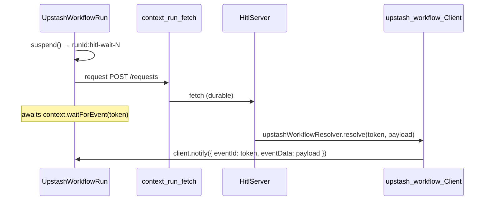

# @hitl-sdk/resolver-upstash-workflow — architecture

Thin binding over hitl's engine contract (`WorkflowPrimitives` + `HitlResolver` from `@hitl-sdk/hitl/core`). State, adapters, and HTTP live on the server; workflow code only suspends, sleeps, and calls the server through a durable step.

## Data flow



## Engine mapping

| hitl primitive | Upstash Workflow API | Implemented in |
|---|---|---|
| `suspend` | `context.waitForEvent(stepId, eventId, { timeout })` | `createUpstashWorkflowHitlClient` |
| `sleep` | `context.sleep(stepName, seconds)` | `createUpstashWorkflowHitlClient` |
| `request` | `context.run(stepName, fetch)` | `createUpstashWorkflowHitlClient` (overridable) |
| `resolve` | `client.notify({ eventId, eventData })` | `upstashWorkflowResolver` |

Timeout and reminder paths are handled by the shared `createHitlClient` logic: `sleep` fires, then the client POSTs to `/timeout`. The long `waitForEvent` timeout (`365d`) is a sentinel — if it ever fires, the suspension promise is left pending so the `sleep`-driven timeout path stays in control.

## Invoke targets — `createHitlUpstashWorkflows`

Like the inngest binding's `createHitlInngestFunctions`, this models each hitl
operation as its own invokable workflow. Parent workflows call them with
`context.invoke`, and you register them with `serveMany`:

```ts
const { waitForHuman, requestHuman, notify } = createHitlUpstashWorkflows(createWorkflow);
// later, inside a parent workflow:
const { body } = await context.invoke("approve", { workflow: waitForHuman, body: { … } });
```

`createWorkflow` is injected (from `@upstash/workflow/<adapter>`) so this package
stays framework-agnostic — the same reason inngest injects its `client`. Each
target builds a `createUpstashWorkflowHitlClient` from its own `context` and runs
one hitl operation; `requestHuman`/`notify` return serializable anchors because
invoke results cross a JSON boundary.

## Two halves (low-level)

### Workflow side — `createUpstashWorkflowHitlClient`

Wraps `createHitlClient` with Upstash Workflow primitives:

```ts
return createHitlClient({
  suspend<T>() {
    waitCounter += 1;
    const token = `${context.workflowRunId}:hitl-wait-${waitCounter}`;
    const promise = context
      .waitForEvent(token, token, { timeout: WAIT_FOR_EVENT_TIMEOUT })
      .then(({ eventData, timeout }) => (timeout ? new Promise<T>(() => {}) : (eventData as T)));
    return { token, promise };
  },
  sleep: (ms) => context.sleep(`hitl-timer-${++sleepCounter}`, Math.ceil(ms / 1000)),
  request, // context.run fetch by default
  url: options.url ?? (() => process.env.HITL_URL ?? ""),
  // ...
});
```

- **`waitForEvent`** — durable, event-sourced wait. The `stepId` and `eventId` are the same token; the workflow resumes when a matching `notify` arrives.
- **`sleep`** — Upstash timer for `timeout` and `reminders`. Upstash sleeps in **seconds**, so hitl's milliseconds are rounded up with `Math.ceil(ms / 1000)`. Sub-second precision is lost, which is fine for human-scale timeouts and reminders.
- **`request`** — durable `context.run` fetch by default; pass `request` to override (custom transport or tests).

### Server side — `upstashWorkflowResolver`

Resumes the run waiting on the token's event:

```ts
export function upstashWorkflowResolver({ client }) {
  return {
    async resolve(token, payload) {
      await client.notify({ eventId: token, eventData: payload });
    },
  };
}
```

Runs in plain Node (API route, serverless handler, etc.) — never inside workflow code. The `client` is an `@upstash/workflow` `Client` constructed with your QStash token.

## Token format

The core treats the token as opaque. This binding uses `` `${context.workflowRunId}:hitl-wait-${n}` `` as both the `waitForEvent` event id and the resume token. It must be **globally unique** because `client.notify({ eventId })` resumes *every* run waiting on that id — namespacing with `workflowRunId` guarantees uniqueness, and the per-call-site counter keeps it stable across replays of the same run. The server passes the token straight to `notify`; no decode layer is needed.

## File layout

```
src/
  index.ts      public re-exports
  workflows.ts  createHitlUpstashWorkflows (context.invoke targets)
  client.ts     createUpstashWorkflowHitlClient (low-level)
  resolver.ts   upstashWorkflowResolver
  constants.ts  WAIT_FOR_EVENT_TIMEOUT
```

## Comparison with other bindings

| | Upstash Workflow | Workflow DevKit | Inngest | Temporal |
|---|---|---|---|---|
| Suspend | `context.waitForEvent` | `createHook()` | `step.waitForEvent` | signal + `condition()` |
| Timer | `context.sleep` (seconds) | `sleep()` | `step.sleep` | `sleep(ms)` |
| Request | `context.run` fetch | `"use step"` fetch | `step.run` fetch | activity fetch |
| Resolve | `client.notify({ eventId })` | `resumeHook(token)` | `client.send(event)` | `handle.signal(name, …)` |
| Token | `runId:hitl-wait-N` (event id) | WDK hook token | `hitl-wait-N` | `{ workflowId, waitToken }` JSON |
