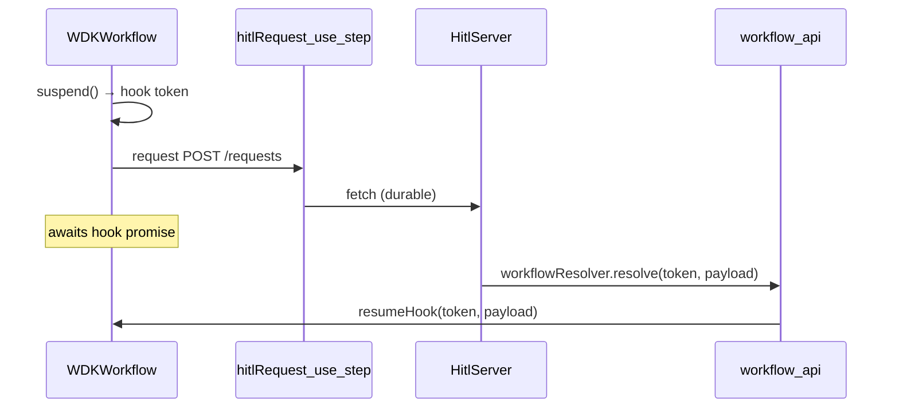

# @hitl-sdk/resolver-workflow-sdk — architecture

Thin binding over hitl's engine contract (`WorkflowPrimitives` + `HitlResolver` from `@hitl-sdk/hitl/core`). State, adapters, and HTTP live on the server; workflow code only suspends, sleeps, and calls the server through a durable step.

## Data flow



## Engine mapping

| hitl primitive | Workflow DevKit API | Implemented in |
|---|---|---|
| `suspend` | `createHook()` | `createWorkflowSdkHitlClient` |
| `sleep` | `sleep(\`${ms}ms\`)` | `createWorkflowSdkHitlClient` |
| `request` | App-defined `"use step"` function | Caller passes `request` option |
| `resolve` | `resumeHook(token, payload)` | `workflowResolver` |

Timeout and reminder paths are handled by the shared `createHitlClient` logic: `sleep` fires, then the client POSTs to `/timeout`. No special WDK code is needed beyond `sleep`.

## Two halves

### Workflow side — `createWorkflowSdkHitlClient`

Wraps `createHitlClient` with Workflow DevKit primitives:

```ts
return createHitlClient({
  suspend<T>() {
    const hook = createHook<T>();
    return { token: hook.token, promise: Promise.resolve(hook) };
  },
  sleep: (ms) => sleep(`${ms}ms`),
  request: options.request,
  url: options.url ?? (() => process.env.HITL_URL ?? getWorkflowMetadata().url),
  // ...
});
```

- **`createHook()`** — event-sourced durable wait. WDK assigns an opaque `hook.token`; the workflow awaits the hook promise until resumed.
- **`sleep`** — WDK timer for `timeout` and `reminders`. Milliseconds are passed as `"Nms"` strings.
- **`request`** — your `"use step"` function. The compiler must see the directive in your app code, not inside this package.

URL resolution order: explicit `url` option → `process.env.HITL_URL` → `getWorkflowMetadata().url` (the deployment's own URL).

### Server side — `workflowResolver`

Resumes the hook a workflow suspended on:

```ts
export function workflowResolver(): HitlResolver {
  return {
    async resolve(token, payload) {
      const { resumeHook } = await import("workflow/api");
      await resumeHook(token, payload);
    },
  };
}
```

`workflow/api` is imported lazily so route modules stay light until a callback actually resolves something.

Runs in plain Node (API route, serverless handler, etc.) — never inside workflow code.

## Token format

The core treats the token as opaque. This binding uses the **WDK hook token** returned by `createHook()` — no encoding or correlation layer. The server passes it straight to `resumeHook(token, payload)`.

## File layout

```
src/
  index.ts     createWorkflowSdkHitlClient
  resolver.ts  workflowResolver
```

## Comparison with other bindings

| | Workflow DevKit | Inngest | Temporal |
|---|---|---|---|
| Suspend | `createHook()` | `step.waitForEvent` | signal + `condition()` |
| Timer | `sleep()` | `step.sleep` | `sleep(ms)` |
| Request | `"use step"` fetch | `step.run` fetch | activity fetch |
| Resolve | `resumeHook(token)` | `client.send(event)` | `handle.signal(name, …)` |
| Token | WDK hook token | `hitl-wait-N` | `{ workflowId, waitToken }` JSON |
